# 锐捷客户端手动破解

教程对福大锐捷适用，锐捷认证采用的是PEAP-GTC的802.1x认证，Windows 10默认不支持，需要安装驱动。

## Windows 10：

***经测试此方法已不适用于Windows11系统***

- 开始前要关闭锐捷自启，或者直接卸载(建议)

- 任务管理器 -> 服务 -> 打开服务

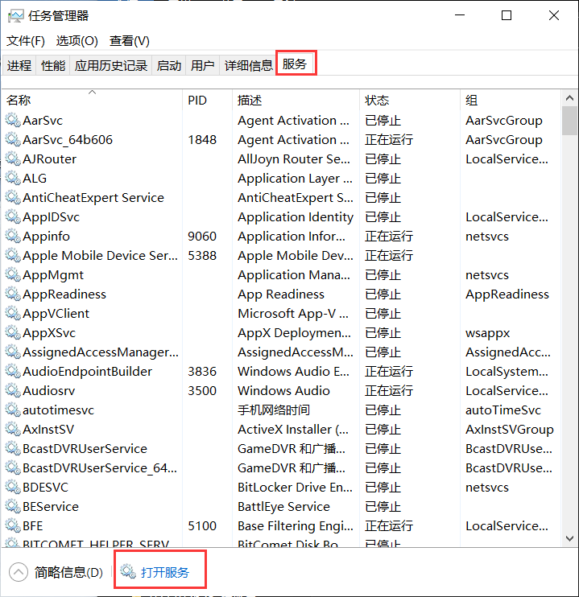

确保以下两个服务是启动状态，**锐捷启动时会禁用以下服务**，所以要关闭锐捷客户端

> Extensible Authentication Protocol
>
> Wired AutoConfig

- 安装EAP-GTC-xXX.msi（XX对应版本），一路确定就行，**安装完会自动重启**，**安装完会自动重启**，**安装完会自动重启**
- 打开“网络和Internet”设置 -> 更改适配器选项 -> 以太网 -> 属性 -> 身份认证，选择**受保护的EAP（PEAP）**，然后点击设置
  - **每次登录时记住此连接的凭据**，也可以选勾，电脑开机就能连上

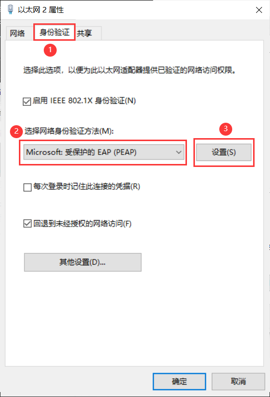

- 取消选勾**通过验证证书来验证服务器身份**，身份验证方法选择**EAP-Token**，点击配置，点击确定

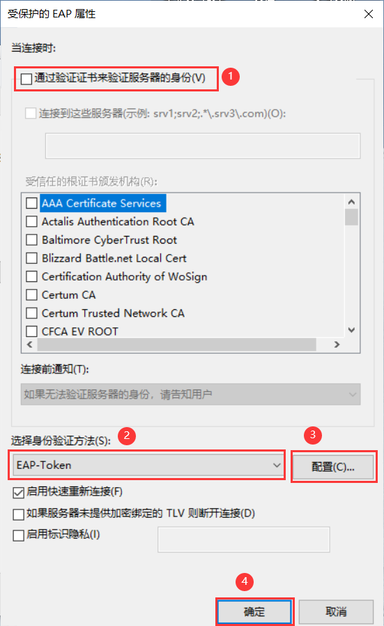

- 再点确定

  可以勾**每次登录时记住此连接的凭据**，则在下次开机启动时会默认连接网络

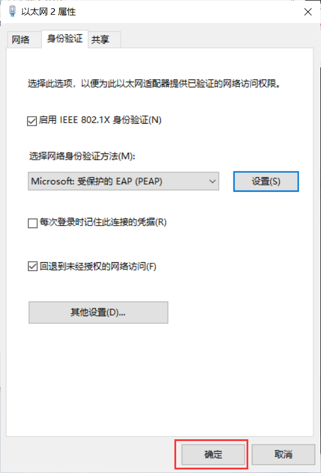

- 此时，会弹出如下窗口，填写账号和密码后点击OK即可

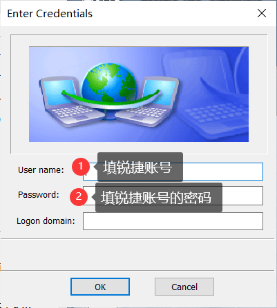

> User name:登陆时的锐捷账号
>
> Password:锐捷账号密码

- 完成以上步骤就可以正常上网，可以**开启共享热点**，**VMware内使用NAT方式可上网**，锐捷客户端直接弃用。

## Windows:

***使用alternative文件夹中的文件，需要有锐捷客户端，文件内容来源：[路由器实现锐捷认证](https://blog.csdn.net/weixin_40500627/article/details/108395293)***

- 抓包

  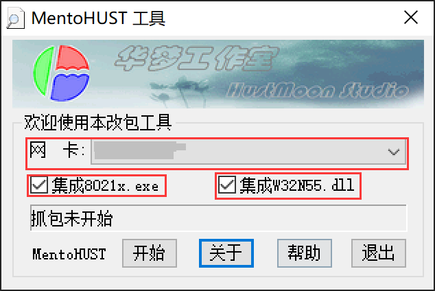

  - 网卡选择有线连接的网卡，**不同电脑网卡名称不一**，视具体情况而定，如Realtek PCIe GBE Family Controller。如图设置完成后，点击开始

  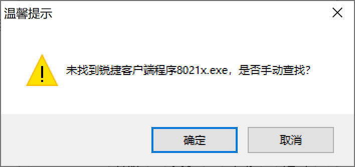

  - 点击确定，找到**8021x.exe**，在锐捷客户端的安装路径下，一般情况下路径为*C:\Program Files\Ruijie Networks\Ruijie Supplicant*

  - 选择后**8021x.exe**，后会弹出原版锐捷客端的认证页面，点击认证（或者自动认证完成），认证完成后**MentoHUST工具**会弹出mpf文件的保存页面，**自己取个名字，保存到自己知道的地方**

- 运行**运行测试软件.exe**进行认证

  ​	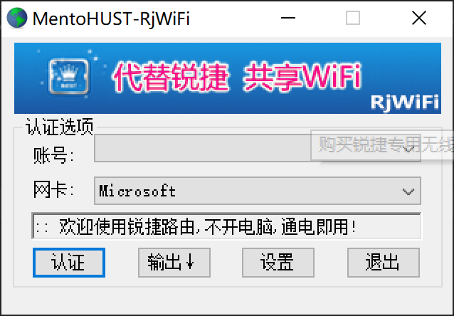

  ***网卡选择有线连接的网卡***

  - 点击**设置**

    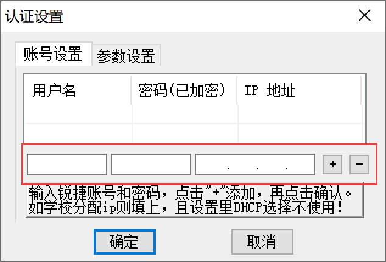

  - 填入锐捷账号（用户名）、锐捷密码后点击**“+”**

  - 点击参数设置

    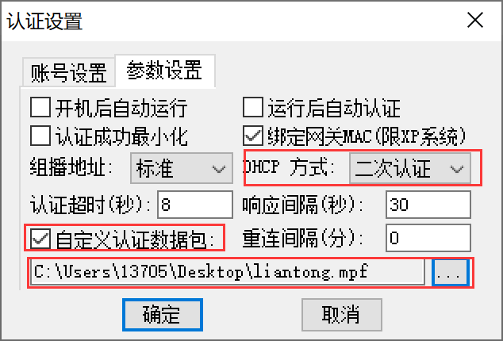

    自定义认证数据包，选择刚刚抓包获得的那个mpf文件

  - 点击确定后，点击认证

    若可以正常认证，则点击最小化即可，若不能认证，则查看输出，排错。

    

  

## Linux(以Ubuntu为例)：

- 打开设置，选择网络选项，点击有线连接的详细设置

  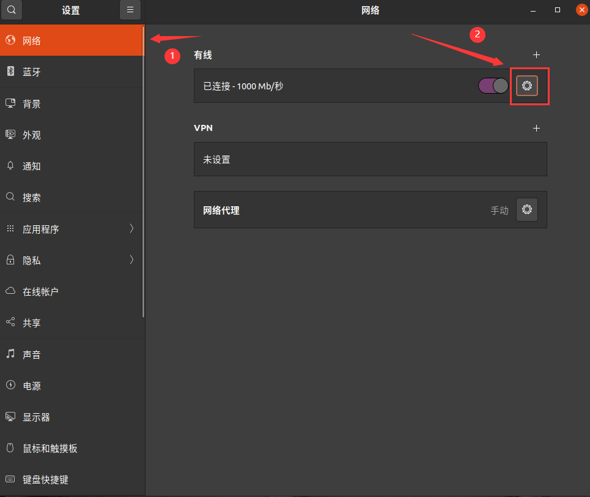

- 选择安全选项进行802.1x认证的设置，具体设置内容如下蓝色方框所示：

  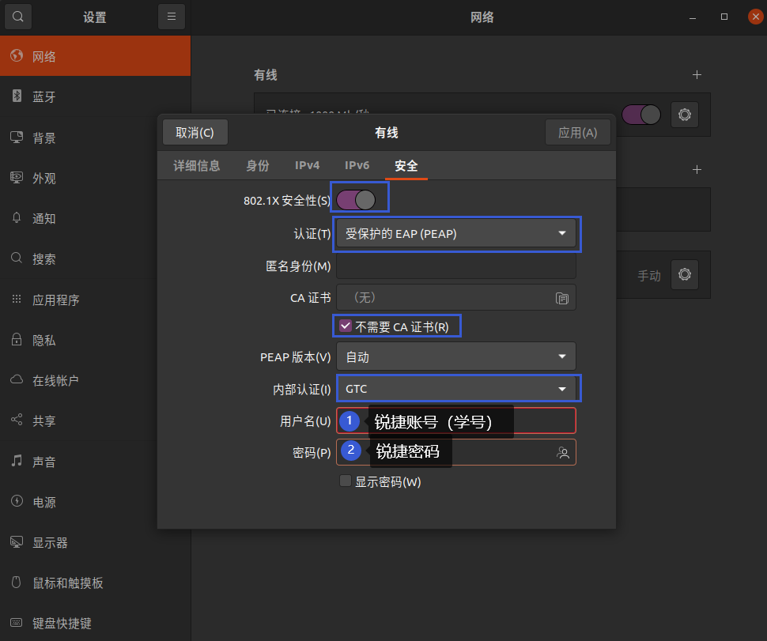

- 其他的Linux系统差不多，重点在于使用的是**EAP-GTC协议**，基本上Linux的桌面操作系统都支持这个协议
