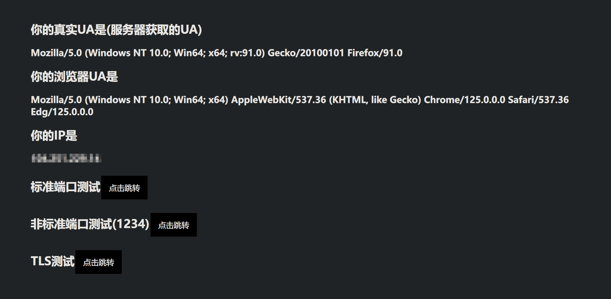

# 绕过设备限制（参考方案）

本文教程仅针对x86_64架构软路由，系统使用基于openwrt深度定制的[iStoreOS](https://www.istoreos.com/)，实测可行版本为`2023060914`

## http——ua伪装

同一设备底下出现多个不同的ua，校园网会认为该设备正在共享网络给其他设备，继而进行拉黑处理。本文使用`ua2f`插件来实现ua伪装。

源项目地址（本文使用）：[imguoliwei/UA2F-cpp](https://github.com/imguoliwei/UA2F-cpp)

也可使用：[Zxilly/UA2F](https://github.com/Zxilly/UA2F)，下载对应版本到iStoreOS后台安装（需要手动将`/etc/init.d/ua2f`中有关防火墙配置的`FORWORD`全部替换为`PREROUTING`）

1. 需要安装的插件：

   > iptables-mod-conntrack-extra iptables-mod-nfqueue libnetfilter-conntrack3 libnetfilter-queue1 libstdcpp6

2. 将`ua伪装`下的文件按照路径放置到软路由指定位置（使用WinSCP拖动`etc`、`usr`到右侧根路径），同时对文件**授予执行权限**（有三个）。

3. 在软路由命令行终端执行以下指令

   ```shell
   service ua2f-mix start
   ```

   没有任何提示则表示运行成功

4. 检查是否运行可执行以下指令

   ```shell
   ps | grep ua2f-mix
   ```

   包含以下内容代表成功运行

   ```shell
   /usr/bin/ua2f-mix 10010 2 --ua --tcp-timestamps
   ```
   
5. 测试效果

   测试地址：https://ua.233996.xyz/

   通过标准端口测试和非标准端口测试，服务器获取的UA和浏览器UA不同说明成功

   

## 代理微信

同一设备底下存在多个微信id，校园网同样会认为该设备正在共享网络给其他设备。本文使用OpenClash来进行代理到其他节点，使得微信流量在校园网中“消失”。**本文不提供任何clash节点和机场，请自行准备**。

1. 安装[OpenClash](https://github.com/vernesong/OpenClash)插件，下载ipk安装包到后台上传安装。

2. 下载clash核心。（按照以下步骤下载完核心后需要导入节点，自行研究，建议使用TUN模式）

   1. 在iStoreOS后台，`服务`->`OpenClash`->`插件设置`->`版本更新`，点击`一键检查更新`，若无法更新继续以下步骤，否则跳出到步骤`3`。

   2. 设置GitHub请求地址

      在iStoreOS后台，`服务`->`OpenClash`->`覆写设置`->`Github 地址修改`，修改为任意一个，回到上一步重试。

3. 将`clash规则`下的文件按照路径放置到软路由指定位置（使用WinSCP拖动`etc`到右侧根路径）

4. 附加规则

   在iStoreOS后台，`服务`->`OpenClash`->`覆写设置`->`附加规则`，在`规则集`处（最底下）点击新增。参考以下图片设置：

   

   注：`规则集匹配顺序`选择一定要选择`优先（覆盖）`，`指定策略组`选择能够走节点的，不可选择`DIRECT`

`运行模式`建议设置为`TUN`，关闭`仅允许常用端口流量`。要验证是否生效可以到任意一个`控制面板`中，查看`连接`中微信相关连接受否转向目标节点

## 其他

1. NTP服务器设置

   在iStoreOS后台，`系统`->`系统`->`时间同步`，勾选`启用 NTP 客户端`、`作为 NTP 服务器提供服务`、`使用 DHCP 通告的服务器`。修改`候选 NTP 服务器`为以下四个：

   > ntp1.aliyun.com
   >
   > time1.cloud.tencent.com
   >
   > time.ustc.edu.cn
   >
   > pool.ntp.org

   

2. 添加防火墙规则

   在iStoreOS后台，`网络`->`防火墙`->`自定义规则`，增加以下内容并保存

   ```shell
   # 防时钟偏移检测
   iptables -t nat -N ntp_force_local
   iptables -t nat -I PREROUTING -p udp --dport 123 -j ntp_force_local
   iptables -t nat -A ntp_force_local -d 0.0.0.0/8 -j RETURN
   iptables -t nat -A ntp_force_local -d 127.0.0.0/8 -j RETURN
   iptables -t nat -A ntp_force_local -d 192.168.0.0/16 -j RETURN
   iptables -t nat -A ntp_force_local -s 192.168.0.0/16 -j DNAT --to-destination 192.168.100.1
   # 通过 iptables 修改 TTL 值
   iptables -t mangle -A POSTROUTING -j TTL --ttl-set 128
   # iptables 拒绝 AC 进行 Flash 检测
   iptables -I FORWARD -p tcp --sport 80 --tcp-flags ACK ACK -m string --algo bm --string " src=\"http://1.1.1." -j DROP
   ```

3. 校园网登录

   使用[HustWebAuth](https://github.com/a76yyyy/HustWebAuth)登陆校园网，下载对应版本重命名为`HustWebAuth`后，上传到`usr/bin/`，**同时授予执行权限**

   登陆指令（参考）：

   ```shell
   HustWebAuth -a username -p password --pingIP 192.168.111.177 
   ```

   注：`HustWebAuth`默认使用ping指令检测是否已连接，**但校园网不限制ICMP协议，所以无论如何都能ping通**，以上指令将ping地址写到一个不存在的地址，绕过HustWebAuth是否已登陆检测，直接执行一次登录。

   本文使用curl指令进行检测，将`NetDown.sh`上传到`usr/bin/`中，同时**授予执行权限**。然后在iStoreOS后台，`系统`->`启动项`->`本地启动脚本`的`exit 0`前添加:

   ```shell
   # 登陆参数输出为文件，
   HustWebAuth -a username -p password --pingIP 172.179.177.177 --syslog -o
   sleep 5s
   # 执行检测脚本，传入登陆指令
   sh /usr/bin/NetDown.sh HustWebAuth login
   ```

   在iStoreOS后台，`系统`->`启动项`->`计划任务`中添加以下指令，每五分钟执行一次检测脚本。

   ```shell
   */5 * * * * sh /usr/bin/NetDown.sh HustWebAuth login
   ```

